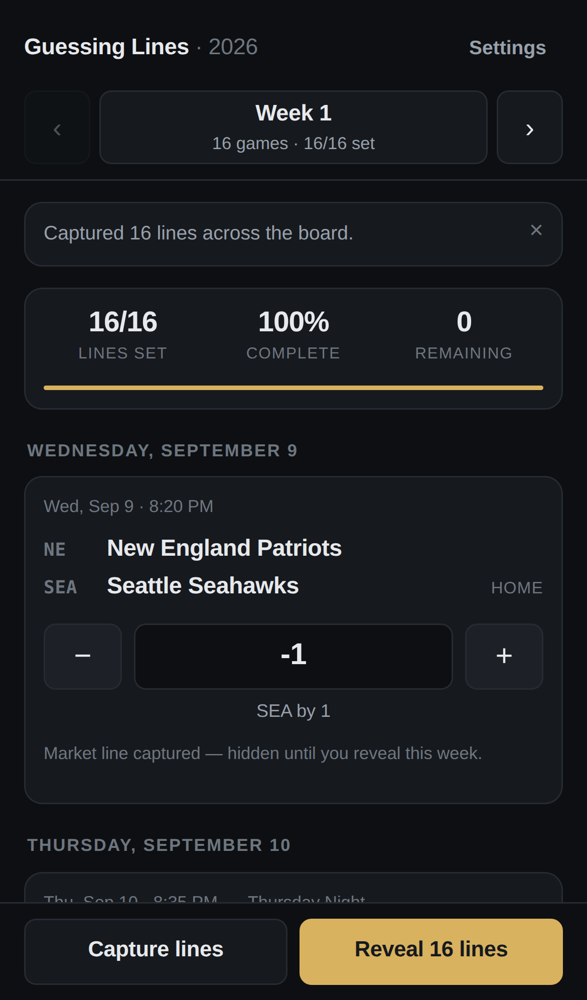
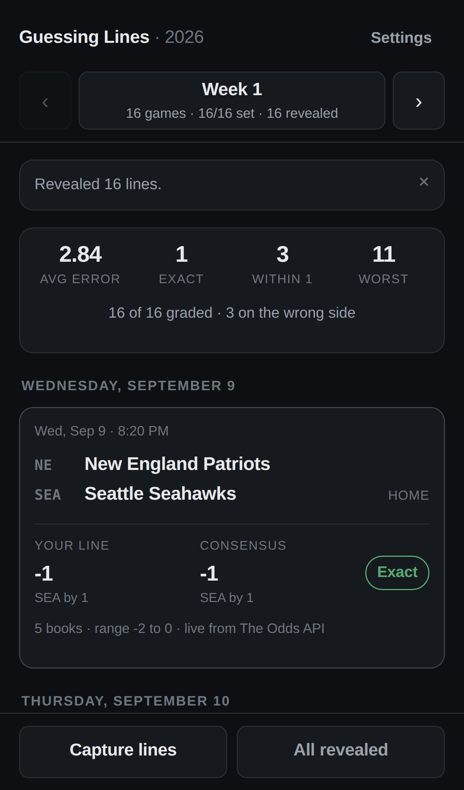
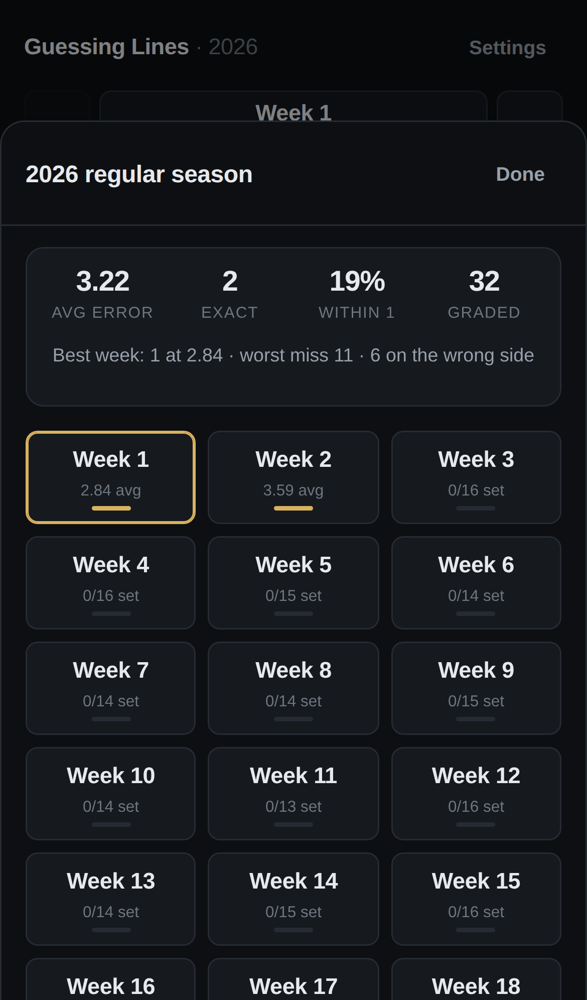

# Guessing Lines — NFL 2026

A mobile-first tool for setting your own point spread on every game of the 2026 NFL
regular season, then comparing it against the market once the game is over.

You enter a line for each game before kickoff. Guesses lock when the ball is kicked.
After the game finishes, **Reveal** shows the consensus spread, your line beside it,
and how far off you were.

```bash
npm install
npm run dev        # http://localhost:5173
npm test           # unit tests for the spread maths and schedule handling
npm run build      # static bundle in dist/, plus a generated service worker
npm run lint
npm run test:e2e   # browser smoke test against the build (see Testing below)
```

No server, no account, no backend. Everything lives in the browser, and the built
`dist/` is plain static files you can host anywhere — the build uses relative paths, so
a domain root and a subpath both work.

| Setting lines | After the games | Season to date |
|---|---|---|
|  |  |  |

<sub>Screenshots are generated by `npm run screenshots` against a stubbed API, so they
stay in step with the code.</sub>

---

## How lines are quoted

Every number in the app is the **home team's** spread.

| You enter | Means |
|---|---|
| `-3.5` | home team favoured by 3.5 |
| `+7` | home team getting 7 |
| `0` or `PK` | pick'em |

The field echoes it back in words (`KC by 3.5`) so there is no ambiguity about which
side you took. The `−` / `+` buttons move the line half a point at a time; you can
also type directly, or use the arrow keys on a desktop keyboard.

## Grading

Reveal compares your line to the **median** spread across the bookmakers The Odds API
returns for that game. The median is used rather than the mean because a single book
hanging an off-market number should not drag the consensus.

| Error | Shown as |
|---|---|
| ≤ 0.25 | `Exact` |
| ≤ 1 | `Off by …` (sharp) |
| ≤ 2.5 | close |
| ≤ 6 | wide |
| > 6 | miss |

A game's input locks once you reveal it — there is no point editing a guess you have
already seen the answer to — but nothing else is time-gated.

Taking the wrong favourite is called out separately — being off by two points is a
different mistake from having the wrong team laying the points. The week header rolls
it all up: average error, exact hits, within a point, worst miss.

Tapping the week name opens the season sheet: your cumulative numbers across every
graded week, your best week, and all 18 weeks at a glance — each showing either how
many lines you have set or, once graded, that week's average error. Tap any week to
jump to it.

---

## The Odds API

Get a key at [the-odds-api.com](https://the-odds-api.com/) (the free tier is 500
requests a month, which is far more than this app needs) and paste it into **Settings**.
It is stored in your browser's `localStorage` and sent only to `api.the-odds-api.com`.

### How Reveal works

Reveal pulls the **current** consensus straight from The Odds API, whenever you tap it.
There is no waiting for kickoff and no historical lookup — you can set a line and
reveal it a minute later if you want to see how close you were to where the market
opened.

One wrinkle worth knowing: **The Odds API drops a game from the board the moment it
finishes.** So for a game that has already been played, there is nothing live left to
fetch. The app covers that by quietly **capturing** the consensus for upcoming games
and keeping it locally — hidden from you, the card only says a line was captured, never
what it was. Reveal then works like this:

1. **The live board**, for any game still listed. This is the number you get almost
   every time.
2. **Your captured snapshot**, for games the board has already dropped.

If neither has a line — most often because books have not posted that week yet — the
app says so instead of inventing one.

Capturing runs on its own at most once an hour when you open a week with games still to
play, and there is a **Capture lines** button to do it by hand. You do not have to
think about it; it just means a line you revealed weeks later still has something to
compare against.

### Request cost

| Action | Requests |
|---|---|
| Testing your key | 0 |
| Capture lines | 1 per region selected |
| Reveal | 1 per region selected |
| Reveal that falls back to captured snapshots | 0 |

Rate limits, an expired key and a dead connection each produce a specific message
rather than a generic failure.

---

## The schedule

`src/data/schedule-2026.json` is the real, released 2026 regular season: all 272
games, actual kickoff dates and times, and the eight international games flagged with
their venue (Melbourne, Maracanã, Wembley, Tottenham, Stade de France, Bernabéu,
Munich, Estadio Banorte). It is imported from the
[nflverse](https://github.com/nflverse/nfldata) dataset (CC BY 4.0):

```bash
npm run schedule:import                                    # refresh from nflverse
node scripts/import-schedule.mjs --csv ./games.csv         # or from a local copy
node scripts/import-schedule.mjs --season 2027             # next year
```

The importer converts nflverse's Eastern kickoff times to UTC, keeps the neutral-site
venues, and refuses to write the file unless what came back is a complete season —
272 games, 32 teams with 17 each, nobody booked twice in a week.

**It deliberately drops every betting column in that file.** The whole exercise is
guessing the line; a spread sitting in the repo would be the answer key. A unit test
asserts none leaks in.

`npm run schedule:fetch` is an alternative that pulls from ESPN's public API. It was
written against their documented shape but could not be run where this repo was built
(no outbound network there), so treat its first run as a check — the nflverse import
is the tested path.

### Importing your own

**Settings → Schedule** takes pasted or uploaded JSON and stores it in the browser
without touching the repo. The importer is forgiving about field names and team
spellings:

```json
{
  "season": 2026,
  "games": [
    { "week": 1, "away": "New England Patriots", "home": "SEA", "kickoff": "2026-09-10T00:20:00Z" }
  ]
}
```

`away`/`awayTeam`/`away_team` and `kickoff`/`commence_time`/`date` all work, and team
names resolve from full names, nicknames or abbreviations (including nflverse's `LA`
for the Rams and ESPN's `WSH`). Games that cannot be resolved are dropped rather than
guessed at. **Use bundled** puts the shipped schedule back.

Replacing the schedule does not touch your guesses — they are keyed by
`season-week-away-home`, so a game keeps its guess as long as the matchup and week
stay the same.


## Installing it

It is a PWA. On a phone, add it to your home screen (Chromium browsers surface a
button in **Settings → Install**; on iOS use Share → Add to Home Screen) and it opens
full screen with its own icon.

A service worker precaches the app shell, so it opens with no signal — your guesses,
captured snapshots and already-revealed lines are local anyway. The worker never
touches `api.the-odds-api.com`: stale odds are worse than no odds. When you are
offline the app says so and disables the two actions that need a network, but you can
still enter and edit lines.

The worker is generated at build time by `scripts/build-sw.mjs`, which precaches
whatever the build just produced and versions the cache by its content. It is not
registered in dev.

## Testing

```bash
npm test                        # 24 unit tests, no browser needed
npm run build
npx playwright install chromium # once
npm run test:e2e                # 25 checks in a real browser
```

The e2e suite serves the production build, stubs The Odds API with a deterministic
payload, and walks the whole flow on a phone-sized viewport: entering and correcting a
line, persistence across a reload, capturing before kickoff (and confirming the
captured number stays hidden), revealing with the clock moved past kickoff, grading,
the season sheet, week navigation and the offline state. It fails on any console error.

CI runs lint, unit tests, the build, the schedule importer and the e2e suite on every
push.

## Storage

`localStorage`, under `ngl.v1.*`: guesses, captured snapshots, revealed lines,
settings, an imported schedule, and which week you were last on. If the browser blocks
storage (private windows, "block site data"), the app keeps working for the session and
says so in Settings instead of throwing.

Two tabs open on the same season stay in step: each adopts writes from the other and
only ever persists values it actually changed, so an idle tab cannot overwrite the one
you are typing in.

**Settings → Your data** exports everything to a JSON file and restores it, which is
also how you move a season between devices or browsers.

## Project layout

```
src/
  App.jsx                  week state, capture and reveal flows
  components/              game card, spread input, sheets, season overview
  hooks/                   persisted state, online status, install prompt
  lib/lines.js             parsing, formatting, consensus, grading
  lib/oddsApi.js           The Odds API client and typed errors
  lib/schedule.js          schedule normalising, event matching, kickoff gating
  lib/storage.js           localStorage with the failure modes handled
  data/teams.js            32 teams plus name resolution
  data/schedule-2026.json  the real 2026 season, imported from nflverse
public/
  icon.svg                 source mark; PNGs are built from it
  manifest.webmanifest
scripts/
  import-schedule.mjs      build the schedule from the nflverse dataset
  fetch-schedule.mjs       alternative: pull it from ESPN
  build-sw.mjs             generates dist/sw.js after a build
  build-icons.mjs          rasterises icon.svg (npm run icons)
  screenshots.mjs          regenerates docs/*.png
test/
  *.test.mjs               node:test suites for lines and schedule
  e2e.mjs                  browser smoke test
```

## Deploying

`.github/workflows/deploy.yml` publishes the repository's default branch to GitHub
Pages on every push.

**One-time setup:** Settings → Pages → Build and deployment → Source: **GitHub
Actions**. A workflow token is not allowed to turn Pages on, so until you do this the
Deploy job stops with a message saying exactly that. Afterwards every push deploys on
its own.

To host it elsewhere, `npm run build` produces a self-contained `dist/` that works on
any static host — Netlify, Cloudflare Pages, an S3 bucket. Two things worth knowing:

- The app has no routes, so a plain static host works as-is; no SPA rewrite needed.
- `sw.js` must sit beside `index.html` (it does, by default) and should not be cached
  by a CDN for long, or updates will lag a release.
